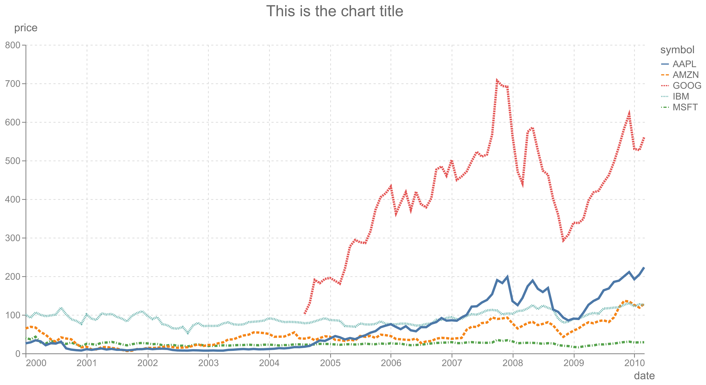
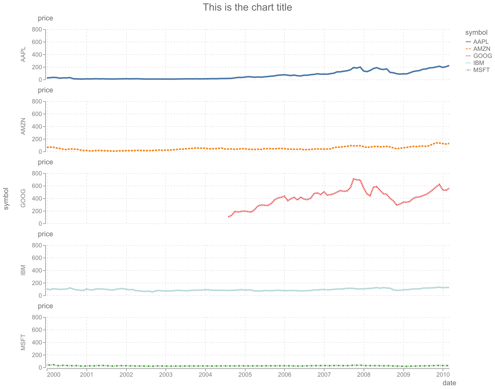

# camminady_altair_theme

A minimal Altair theme.

## Installation

```bash
pip install camminady_altair_theme
```

## Usage

```python
import altair as alt
from camminady_altair_theme import camminady

alt.theme.enable("camminady")
```

## Examples

A simple chart.


And a faceted version.

